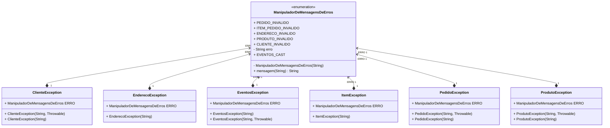

# Domain-Driven Design (DDD) 

Domain-Driven Design (DDD) é uma metodologia aplicada no desenvolvimento de software que prima pela incorporação e centralização do conhecimento de domínio durante a construção de sistemas complexos. 
Este conceito foi difundido principalmente por meio do livro de **Eric Evans**, ["Domain-Driven Design: Tackling Complexity in the Heart of Software"](https://www.amazon.com/Domain-Driven-Design-Tackling-Complexity-Software/dp/0321125215).

Na busca pelo entendimento de DDD, deparar-se-á com alguns conceitos chaves:

- **Modelo de Domínio**: Representa a totalidade da problemática à qual o software propõe-se resolver, em forma de um sistema estruturado e elucidativo.

- **Linguagem Ubíqua**: Uma linguagem desenvolvida em comum acordo e compreensão entre desenvolvedores e usuários a fim de comunicar-melhor a complexidade do problema e minimizar mal-entendidos.

- **Contextos Delimitados**: A forma de decompor sistemas grandes e complexos em sub-sistemas ou 'contextos delimitados' menores e de mais fácil gerenciamento. Cada contexto possui seu próprio modelo de domínio, o qual só possui validade dentro do seu respectivo contexto.

- **Entidades, Objetos de Valor e Agregados**: DDD propõe padrões específicos para lidar com objetos de domínio, tais como Entidades (objetos com uma identidade única), Objetos de Valor (objetos definidos exclusivamente por seus atributos) e Agregados (conjunto de objetos tratados como uma unidade).

- **Serviços de Domínio**: São operações conceituais dentro do domínio que não estão associadas diretamente a uma Entidade ou Objeto de Valor.

- **Fábricas**: São responsáveis pela encapsulação da lógica de instanciar objetos complexos.

- **Repositórios**: Coleções de agregados ou entidades, geralmente utilizados para obter acesso persistente.

Vale ressaltar que este é somente um panorama superficial de DDD. A metodologia é vasta e aprofundada e é altamente recomendado um estudo mais minucioso para quem desejar incorporá-la ao seu processo de desenvolvimento.

---
## Domain

### Entities

### Events

### Repositories

### Services

---

## Exceptions

---
## Infrastructure

### DB

---

## Mappers

---
## Repository

---
